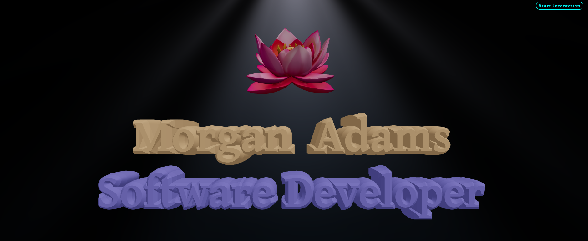
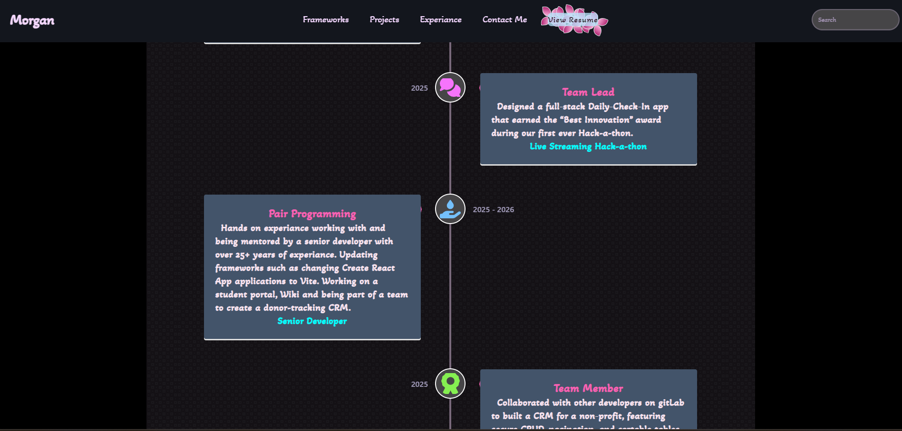

## 🎨 Personal Portfolio

A fully‑featured, responsive personal portfolio built with React, Three.js, Redux, Tailwind CSS, DaisyUI, Motion, and React Hot Toast.

The site showcases my certifications, work experience, and provides a downloadable & printable resume.

Visit the live demo: https://your-portfolio-demo.com

## 🚀 Overview / 🛠️ Tech Stack

Dynamic 3D visualisation – Interactive 3D scene powered by Three.js

State management – Redux for global data flow

Utility‑first styling – Tailwind + DaisyUI components

Animations – Motion for scroll animations

Contact Me Form – Toast notifications via React Hot Toast

Resume – PDF download + print button

The project is a showcase of modern web‑development techniques and my professional background.

## 📄 Features
3D Hero Section	A rotating 3D Lotus Flower that reacts to mouse movement.	

Experience Timeline	Timeline of work experience.

Download/ Print Resume	Link to a PDF of my resume.

Toast Notifications	Success/error toasts for `Contact Me` form.	

Responsive Design	Mobile‑first layout, adapts to all screen sizes.

## 📝 Usage

Click `Start Interaction` to expierance the three.js animations of lotus flower. `Stop Interaction` to scroll down the page.

Browse through my personal projects and watch short videos of the website under `Projects`

Download Resume – Click the `View Resume` button in the navbar; a PDF preview will appear.

Navigation – Smooth scrolling; reappearing navbar on scroll-up.

## 📄 License
MIT © Morgan Adams
See the LICENSE file for details.

## 📬 Contact
Contact me through my contact form on my live site!

## 🙏 Acknowledgements
Three.js – For the 3D rendering engine

Tailwind CSS & DaisyUI – For rapid, consistent UI styling

Redux Toolkit – For clean state management

Motion – For fluid animations

React Hot Toast – For unobtrusive notifications

Happy coding! 🚀